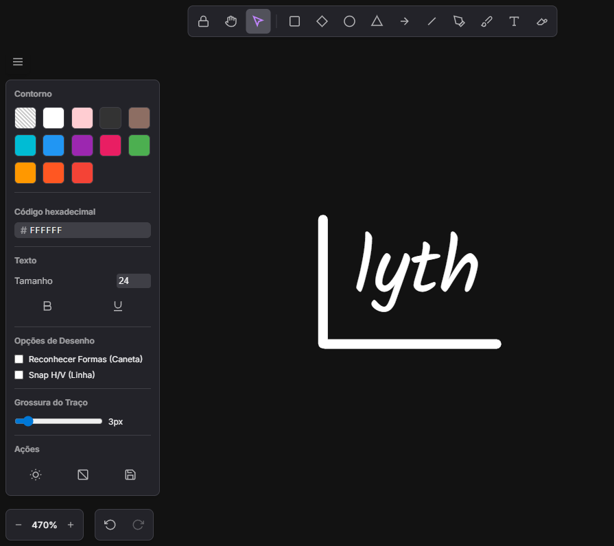

# Drawly 🎨

Uma ferramenta de desenho intuitiva e moderna.



## 📥 Download

**[⬇️ Baixar Drawly para Windows](https://github.com/masterwillian/draw/releases/latest)**

> Escolha `Drawly.1.0.0.exe` para usar direto (portátil) ou `Drawly.Setup.1.0.0.exe` para instalar.

---

## ✨ Funcionalidades

### Ferramentas de Desenho
- **Caneta** - Desenho livre com traço suave
- **Pincel** - Traço mais espesso com efeito de brilho
- **Retângulo, Losango, Círculo, Triângulo** - Formas geométricas
- **Linha e Seta** - Linhas retas com ou sem ponta
- **Texto** - Texto multilinhas editável
- **Borracha** - Apaga objetos inteiros

### Transformações
- **Mover** - Arraste objetos pelo canvas
- **Rotacionar** - Gire objetos usando o handle superior
- **Redimensionar** - Escale objetos pelos cantos ou bordas
- **Seleção Múltipla** - Arraste para selecionar vários objetos

### Personalização
- **Cores** - Paleta de cores + seletor hexadecimal
- **Grossura do Traço** - Ajuste de 1px a 20px
- **Tamanho do Texto** - 12 a 120px
- **Tema Claro/Escuro** - Alterne entre temas

### Recursos Extras
- Undo/Redo ilimitado
- Zoom e navegação (pan)
- Exportar como PNG
- Snap de linha em 90°
- Reconhecimento de formas desenhadas à mão

---

## ⌨️ Atalhos de Teclado

| Atalho | Ação |
|--------|------|
| `P` | Caneta |
| `B` | Pincel |
| `R` | Retângulo |
| `C` | Círculo |
| `D` | Losango |
| `L` | Linha |
| `A` | Seta |
| `T` | Texto |
| `V` | Mover |
| `E` | Borracha |
| `H` | Mão (Pan) |
| `Ctrl+Z` | Desfazer |
| `Ctrl+Y` | Refazer |
| `Ctrl+S` | Salvar Imagem |
| `Delete` | Apagar selecionado |
| `Scroll` | Zoom |

---

## 🛠️ Para Desenvolvedores

```bash
git clone https://github.com/masterwillian/draw.git
cd draw
npm install
npm start          # Rodar em dev
npm run build:win  # Gerar executável
```

---

## 📝 Licença

MIT License - Sinta-se livre para usar, modificar e distribuir.

---

Feito com ❤️ por [@masterwillian](https://github.com/masterwillian)
